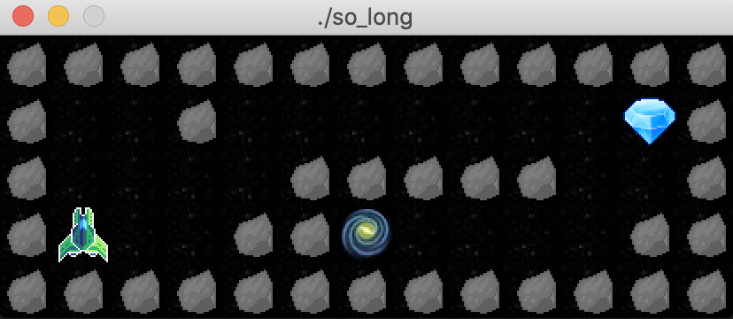

# SO_LONG ROADMAP
This is the roadmap of so_long project. Here will some of the informations needed to do the project.

## Check arguments
There must be only one argument, which is the path to the map.

It must be a .ber

For example : "./img/map.ber"

## Map
Maps needs to be .ber format.

A valid map is structured as followed :
- 1 player (P)
- at least 1 exit (E)
- at least 1 collectible (C)
- is rectangular
- has a solid outside border of walls (1)
- I add the letter D for death (if the player touch it he dies)
- all the empty spaces are filled with 0
- not other characters than :
	- P
	- E
	- C
	- 0
	- 1
	- D

For example :

	1111111111111
	10010000000C1
	1000011111001
	1P0011E000011
	1111111111111

Which would look like this :

 
(image source : https://github.com/tblaase/so_long/blob/master/images/example.png)

## Check map

Use GNL to get the map in a char ** variable.

Check if only the allowed characters are here.

If so then check if the len is the same everywhere and that the lan is bigger than the number of lines (if it's a rectangle).

Check if there is at least one exit, at least one collectable, one player.

Check if there is wall all around the map.

Check if the map is winnable. (Pathfinding algo)

## Pathfinding algorithm

## Load Map

When all the checks are good, we can draw the map.
- P will be steve from minecraft
- E will be a bed from minecraft
- C will be diamonds from minecraft
- 0 will be grass from minecraft
- 1 will be bedrock from minecraft
- D will be lava from minecraft

Each of them will have the size of 50 pixel x 50 pixel

Note that the player, the collectable, the exit and the traps must be on top of grass.
